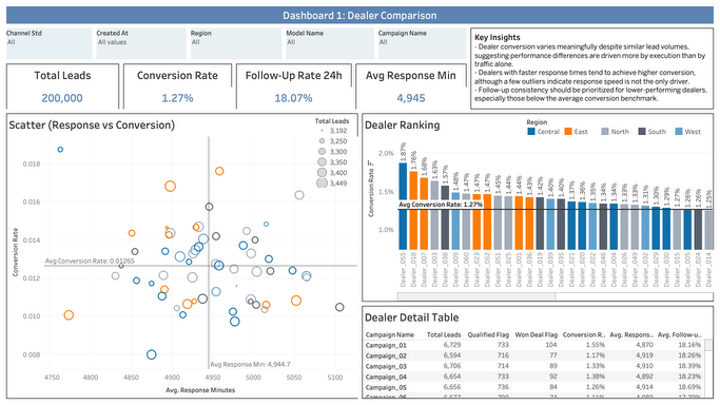
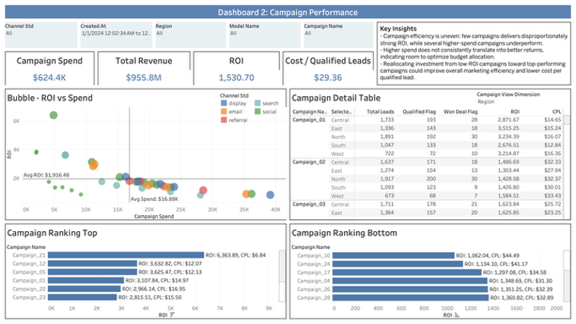
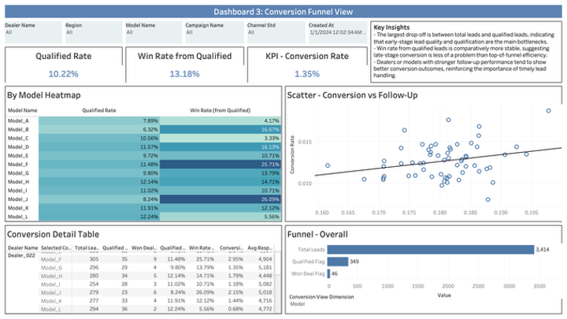

# CRM Lead Funnel Analytics Dashboard

A portfolio analytics project built with synthetic CRM, campaign, and sales data to evaluate dealer performance, marketing efficiency, and lead conversion funnel health.

This project demonstrates KPI standardization, data preparation, and dashboard storytelling for business performance monitoring using Python and Tableau.

## Project Overview

This project simulates how sales, marketing, and CRM teams can use a unified dashboard to evaluate:

- dealer performance
- campaign efficiency
- conversion funnel health

The dashboard is structured around three views:

1. **Dealer Comparison** — compare dealer conversion, follow-up rate, and response speed
2. **Campaign Performance** — evaluate ROI, cost per qualified lead, and spend efficiency
3. **Conversion Funnel View** — identify where leads drop off from total leads to qualified to won deals

## Business Questions

- Which dealers underperform despite receiving comparable lead volume?
- Which operational metrics are most associated with stronger conversion performance?
- Which campaigns generate efficient qualified leads rather than low-quality volume?
- At which stage of the funnel do the largest drop-offs occur?

## Key Findings

### Dealer Comparison
- Dealer conversion varies even at similar lead volumes, indicating execution differences across dealers.
- Faster response time is generally associated with stronger conversion performance.
- The main opportunity is to improve follow-up discipline among dealers below the average conversion benchmark.

### Campaign Performance
- Campaign ROI is concentrated in a small number of higher-performing campaigns.
- Higher spend does not always lead to better returns, suggesting budget inefficiency in some campaigns.
- Reallocating spend toward efficient campaigns could improve ROI and reduce cost per qualified lead.

### Conversion Funnel View
- The largest funnel drop-off occurs before leads become qualified opportunities.
- Win rate from qualified leads is relatively more stable than top-of-funnel conversion.
- Improving lead quality and early follow-up is likely to have the biggest impact on overall conversion.

## Dashboard Preview

### Dealer Comparison


### Campaign Performance


### Conversion Funnel View



## Tech Stack

- **Python** for data cleaning and synthetic data generation
- **SQL-style modeling logic** for KPI definition and table joins
- **Tableau** for interactive dashboard design
- **Git/GitHub** for version control and documentation

## Repository Structure

```text
crm-lead-funnel-analytics-dashboard/
├── README.md
├── data/
│   ├── raw/
│   │   ├── campaigns.csv
│   │   ├── dealers.csv
│   │   ├── interactions.csv
│   │   ├── leads.csv
│   │   ├── models.csv
│   │   └── outcomes.csv
│   └── curated/
│       ├── interactions_curated.csv
│       ├── leads_curated.csv
│       └── outcomes.csv
├── notebooks/
│   └── KPI_dashboard.ipynb
├── dashboards/
│   └── Book2.twbx
├── assets/
│   ├── dealer_comparison.png
│   ├── campaign_performance.png
│   └── conversion_funnel.png
├── docs/
│   ├── data-dictionary.md
│   ├── kpi-definitions.md
│   └── methodology.md
└── .gitignore
```

## Dataset Notes

This project includes synthetic datasets designed to reflect a realistic CRM and sales workflow. No real customer data, confidential business data, or proprietary employer information is included.

## KPI Definitions

- **Conversion Rate** = Won Deals / Total Leads  
- **Qualified Rate** = Qualified Leads / Total Leads  
- **Win Rate from Qualified** = Won Deals / Qualified Leads  
- **Follow-Up Rate 24h** = Leads contacted within 24 hours / Total Leads  
- **Cost per Qualified Lead (CPL)** = Campaign Spend / Qualified Leads  
- **ROI** = Revenue / Spend  

## How to Use

1. Review the raw and curated CSV files in the `data/` folder.  
2. Open the notebook in `notebooks/` to inspect data preparation logic.  
3. Open the Tableau workbook in `dashboards/` to explore the dashboard.  
4. Read the documentation in `docs/` for KPI and methodology details.  

## Why This Project Matters

This project reflects how analytics can support business decisions beyond reporting. The goal is not just to visualize performance, but to distinguish whether issues come from lead quality, campaign efficiency, or dealer execution, and to translate those findings into practical recommendations.

## Disclaimer

All data used in this project is synthetic and generated for demonstration purposes only. No real customer data, confidential business data, or proprietary employer information is included.
